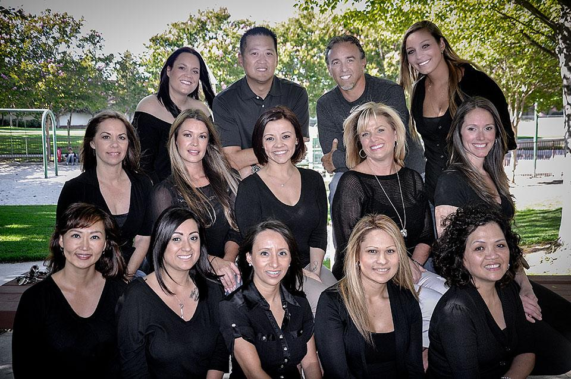
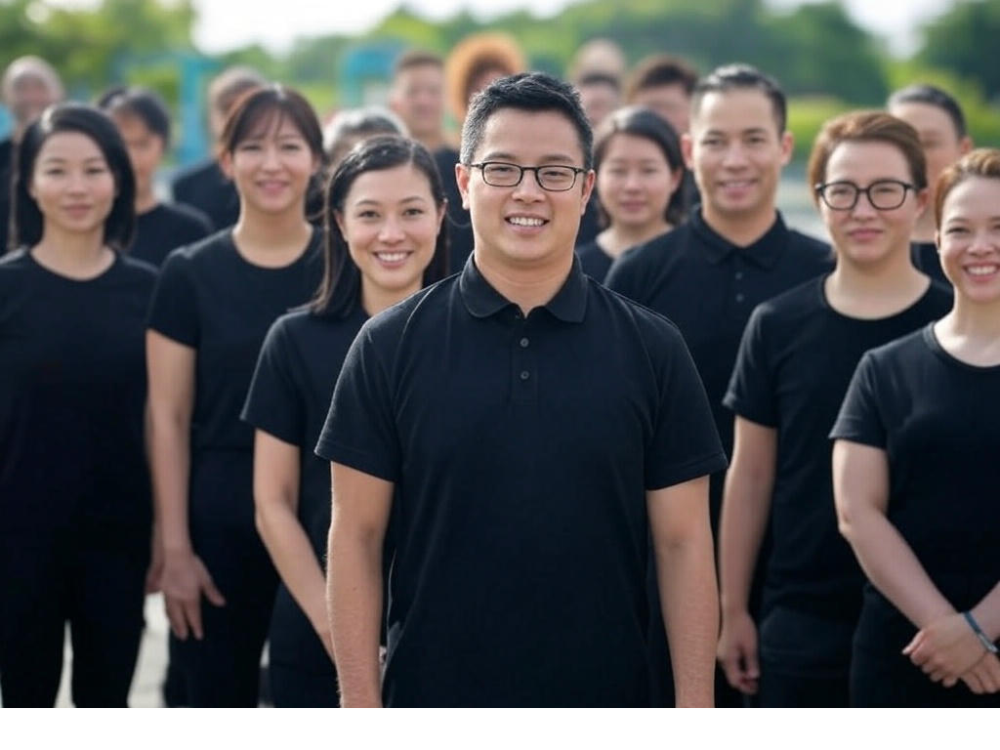
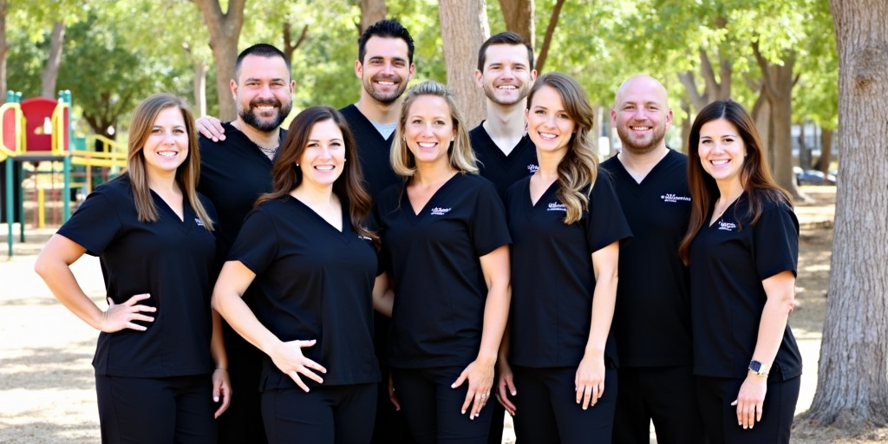

# Deepfake Detection Survey

Welcome to the **Deepfake Detection Survey** repository! This README will guide you through how the dataset was assembled, how prompts were extracted, and how images were generated using various state‑of‑the‑art methods.

---

## 🔍 Overview

This survey presents 24 real photographs paired with 24 synthetic images generated from their corresponding text prompts. Participants are asked to judge whether each image is **Real** or a **Deepfake**. At the end, we display scores and a visual review of any misclassifications.

## 📸 Real Images

* **Source**: LAION‑400M dataset
* **Prompt Extraction**: We used a multimodal model (Qwen‑2.5) to automatically extract a concise descriptive prompt for each real photograph. You can see the prompts used in *prompts.txt*.

```text
Example Prompt (real/image_0.jpg): “A photograph of the Mission Hills Endodontic staff, consisting of several individuals dressed in black, posing together outdoors with trees and playground equipment in the background.”
```

These prompts serve as inputs to various generative models, producing diverse synthetic counterparts.

---

## 🤖 Synthetic Generation Methods

We generated 24 images from each prompt using the following models:

| Model                    | Origin      | Notes                                                                                 |
| ------------------------ | ----------- | ------------------------------------------------------------------------------------- |
| **ChatGPT 4o**           | OpenAI      | Excellent with rendering text in scenes; overall look is soft and painterly.          |
| **Imagen 3**             | Google      | Highly photorealistic but often struggles with legible text.                          |
| **Grok**                 | xAI         | Great at rendering people and known figures; less reliable on complex scenes.   |
| **Flux.1-dev**          | Open Source | Leading open‑source image model; balances realism and prompt fidelity.                |
| **Stable Diffusion 2.1** | Open Source | State‑of‑the‑art in 2022; set the benchmark for community models.                     |
| **Stable Diffusion 3.5** | Open Source | Improved visual quality but sometimes loses prompt adherence; hands/faces can be off. |

---

## 🎨 Example Images

<p align="center">
  
  
  
  
</p>

<p align="center">
  
  
  
</p>

> *Tip: Browse the full set of images under each model’s folder to see how they handle different scenes and objects.*

---

## 📁 Repository Structure

```
├── index.html            # jsPsych survey implementation
├── prompts.txt           # The list of prompts
├── README.md             # This document
└── images/
    ├── real/             # 24 original photographs
    ├── 4o/               # ChatGPT 4o outputs
    ├── Imagen/           # Google Imagen 3 outputs
    ├── Grok/             # xAI Grok outputs
    ├── Flux.1-dev/       # Flux Dev v1 outputs
    ├── SD2/              # Stable Diffusion 2.1 outputs
    └── SDv3.5/           # Stable Diffusion 3.5 outputs
```

---

This is a side survey for an upcoming research paper. Citation to come...

